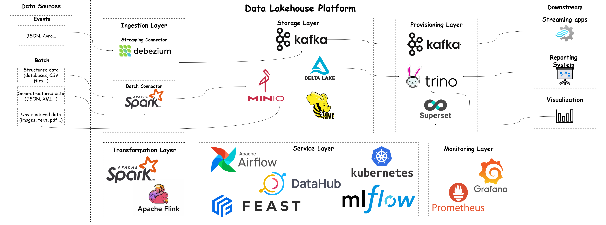

# Scalable Real-time Fraud Detection Engine Built on Lakehouse Architecture



# Table of Contents
- [Scalable Real-time Fraud Detection Engine Built on Lakehouse Architecture](#scalable-real-time-fraud-detection-engine-built-on-lakehouse-architecture)
- [Table of Contents](#table-of-contents)
- [1. Overview](#1-overview)
- [2. Installation](#2-installation)
  - [2.1 Install Ansible and Prepare Environment](#21-install-ansible-and-prepare-environment)
  - [2.2 Run Rancher with Docker](#22-run-rancher-with-docker)
  - [2.3 Create and Configure RKE2 Cluster](#23-create-and-configure-rke2-cluster)
    - [Create a new Kubernetes cluster in Rancher UI:](#create-a-new-kubernetes-cluster-in-rancher-ui)
    - [Select node roles in the Registration step](#select-node-roles-in-the-registration-step)
    - [Register nodes with Ansible](#register-nodes-with-ansible)
    - [Set up kubeconfig on your Rancher host](#set-up-kubeconfig-on-your-rancher-host)
    - [(Optional) Set useful kubectl aliases](#optional-set-useful-kubectl-aliases)
  - [2.4 Install Longhorn](#24-install-longhorn)
  - [2.5 Install Minio](#25-install-minio)
  - [2.6 Install Airflow](#26-install-airflow)
  - [2.7 Install Kafka](#27-install-kafka)
  - [2.8 Install Spark Operator](#28-install-spark-operator)
  - [2.9 Install Flink Operator](#29-install-flink-operator)
  - [2.10 Install Hive Metastore](#210-install-hive-metastore)
  - [2.11 Install sources](#211-install-sources)
  - [2.12 Install Kafka Connect](#212-install-kafka-connect)
  - [2.13 Install Trino](#213-install-trino)
  - [2.14 Install Superset](#214-install-superset)
  - [2.15 Install MLFlow](#215-install-mlflow)
  - [2.16 Install Feast](#216-install-feast)
  - [2.17 Install Datahub](#217-install-datahub)
  - [2.18 Install Prometheus Operator](#218-install-prometheus-operator)
- [3. Run Applications](#3-run-applications)
- [4. License](#4-license)

# 1. Overview

This project demonstrates a scalable real-time fraud detection system built on a modern Data Lakehouse architecture. It integrates batch and streaming data pipelines using open-source Big Data technologies such as Apache Flink, Kafka, Spark, Delta Lake, and MLflow. The system is designed for low-latency inference, feature enrichment, and end-to-end observability, supporting both operational analytics and machine learning in production environments.

# 2. Installation

## 2.1 Install Ansible and Prepare Environment

Install Ansible on your Rancher host machine (Ubuntu/Debian-based):

```bash
apt update
apt install -y software-properties-common
add-apt-repository -y --update ppa:ansible/ansible
apt install -y ansible
```

Clone this repository and navigate to the root of the project:

```bash
git clone https://github.com/vuhuusy/data-lakehouse-platform.git
cd data-lakehouse-platform
```

Run the Ansible playbooks to prepare the host:

```bash
ansible-playbook infra/ansible/playbooks/base-setup.yml
ansible-playbook infra/ansible/playbooks/setup-rancher-nodes.yml
```

## 2.2 Run Rancher with Docker

Start a standalone Rancher server using Docker:

```bash
docker run -d --restart=unless-stopped \
  --name rancher \
  -p 80:80 -p 443:443 \
    --privileged \
  --memory="3g" --cpus="1.5" \
  -v /opt/rancher-data:/var/lib/rancher \
  rancher/rancher:latest
```

Get the initial admin password (bootstrap password):

```bash
docker logs rancher 2>&1 | grep "Bootstrap Password:"
```

Access the Rancher UI in your browser:

```bash
https://<your_rancher_host_ip_addr>
```

Login with the bootstrap password and follow the instructions to set a new admin password.

## 2.3 Create and Configure RKE2 Cluster

### Create a new Kubernetes cluster in Rancher UI:
- From the Rancher home page, click Create, then choose Custom for a self-hosted K8s cluster.
- Enter a name for the cluster (e.g., lakehouse) and leave other settings as default.


### Select node roles in the Registration step
- Assign ``etcd`` and ``Control Plane`` roles to your master node(s).
- Assign ``Worker`` role to worker node(s).
- **Important**: Select the Insecure option to disable TLS verification if needed.

### Register nodes with Ansible

Update the following variables in your inventory file:

```bash
nano infra/ansible/inventory/group_vars/all.yml
```

Edit values:

```bash
server_url: "https://<your_rancher_server_ip>"
token: "<your_cluster_token>"
ca_checksum: "<your_cluster_ca_checksum>"
```

Then run the RKE2 setup playbook:

```bash
ansible-playbook infra/ansible/playbooks/setup-rke2-nodes.yml
```

### Set up kubeconfig on your Rancher host

After the cluster is active, download its KUBECONFIG file from the top-right menu of the Rancher UI.
Copy it into your Rancher host at:


```bash
mkdir -p ~/.kube
nano ~/.kube/config
# Paste your KUBECONFIG into that file
```

Then verify ``kubectl`` works:

```bash
kubectl get nodes
```

### (Optional) Set useful kubectl aliases

Edit your shell config:

```bash
nano ~/.bashrc
```

Add these aliases:

```bash
alias k='kubectl'
alias kgp='kubectl get pods'
alias kgs='kubectl get svc'
alias kdp='kubectl describe pod'
alias kgn='kubectl get nodes'
alias kaf='kubectl apply -f'
alias kdf='kubectl delete -f'
alias kctx='kubectl config use-context'
alias kns='kubectl config set-context --current --namespace'
# add more for your needs, then apply the change
```

Apply the changes:

```bash
source ~/.bashrc
```

## 2.4 Install Longhorn

```bash
make -f infra/services/longhorn/Makefile install
```

## 2.5 Install Minio

```bash
make -f infra/services/minio/Makefile create-namespace

make -f infra/services/minio/Makefile generate-self-signed-cert

make -f infra/services/minio/Makefile register-self-signed-cert

make -f infra/services/minio/Makefile install

make -f infra/services/minio/Makefile create-nodeport
```

## 2.6 Install Airflow

```bash
make -f infra/services/airflow/Makefile install

make -f infra/services/airflow/Makefile create-clusterrolebinding-for-spark-applications
```

## 2.7 Install Kafka

```bash
make -f infra/services/kafka/Makefile generate-self-signed-cert-keystore-truststore

make -f infra/services/kafka/Makefile register-self-signed-cert-keystore-truststore

make -f infra/services/kafka/Makefile install
```

## 2.8 Install Spark Operator

```bash
make -f infra/services/spark/Makefile build-spark-application-dockerfile

make -f infra/services/spark/Makefile release-docker-image

make -f infra/services/spark/Makefile install
```

## 2.9 Install Flink Operator

```bash
make -f infra/services/flink/Makefile build-flink-custom-dockerfile

make -f infra/services/flink/Makefile release-docker-images

make -f infra/services/flink/Makefile install-cert-manager

make -f infra/services/spark/Makefile install
```

## 2.10 Install Hive Metastore

```bash
make -f infra/services/hive/Makefile build-metastore-custom-dockerfile

make -f infra/services/hive/Makefile build-schematool-custom-dockerfile

make -f infra/services/hive/Makefile release-docker-images

make -f infra/services/hive/Makefile install
```


## 2.11 Install sources

```bash
make -f infra/services/sources/Makefile install
```

## 2.12 Install Kafka Connect

```bash
make -f infra/services/kafka/kafka-connect/Makefile build-custom-dockerfile

make -f infra/services/kafka/kafka-connect/Makefile release-docker-image

make -f infra/services/kafka/kafka-connect/Makefile install

make -f infra/services/kafka/kafka-connect/Makefile create-postgres-connector

# install kafka ui
make -f infra/services/kafka/kafka-ui/Makefile install
```

## 2.13 Install Trino

```bash
make -f infra/services/trino/Makefile build-trino-custom-dockerfile

make -f infra/services/trino/Makefile release-docker-images

make -f infra/services/trino/Makefile install
```

## 2.14 Install Superset

```bash
make -f infra/services/superset/Makefile install
```

## 2.15 Install MLFlow

```bash
make -f infra/services/mlflow/Makefile install
```

## 2.16 Install Feast

```bash
make -f infra/services/feast/Makefile install-online-store
```

## 2.17 Install Datahub

```bash
make -f infra/services/datahub/Makefile install
```

## 2.18 Install Prometheus Operator

```bash
make -f infra/services/monitoring/Makefile install
```

# 3. Run Applications

# 4. License

MIT License. See [LICENSE](./LICENSE) for details.
